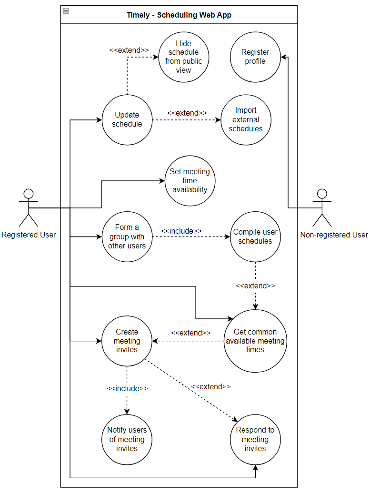
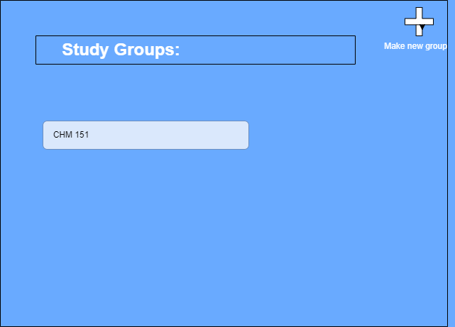
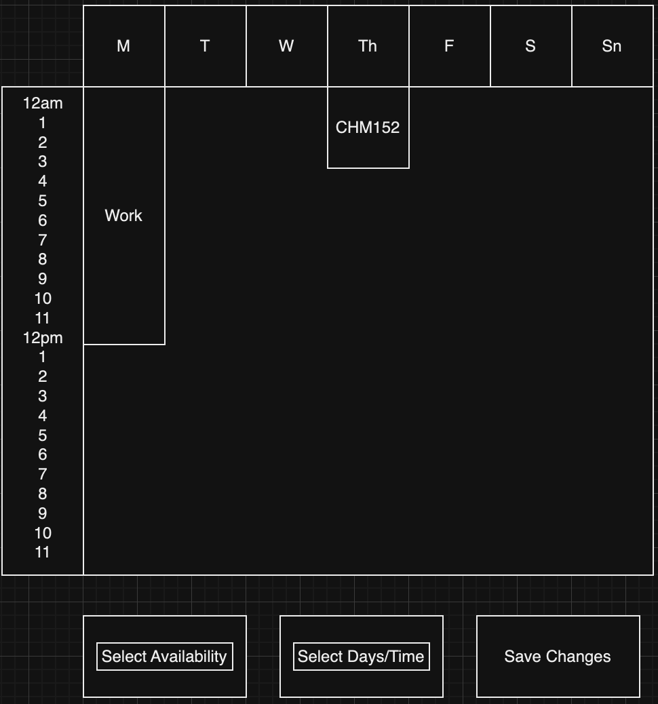
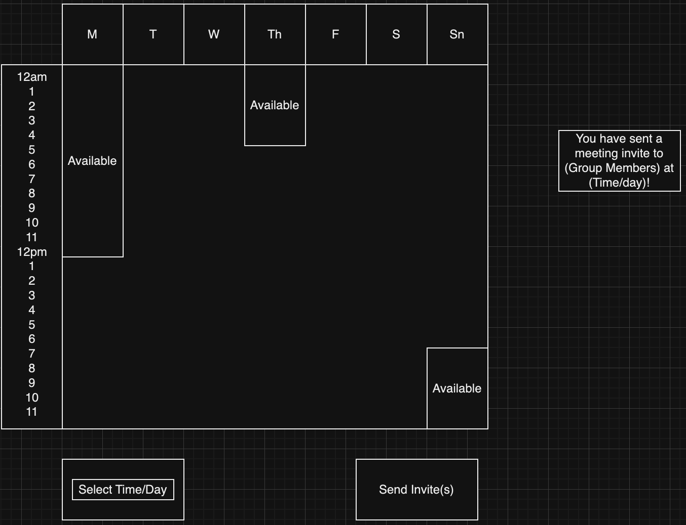
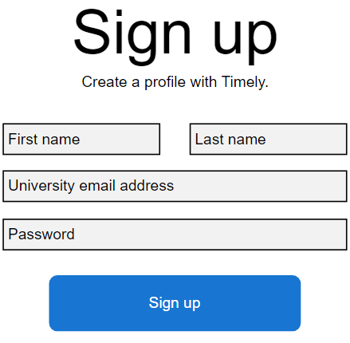

# D2. Requirements

_Group 02 - "Timely"_\
_Group Members: Brody England, Christian Butler, Dylan Hyer, Ian Nieto, Nyle Huntley, Sofia Mendoza_

## 1. Positioning

### 1.1 Problem Statement
The problem of managing and coordinating schedules for academic, work, and personal commitments affects busy university students, the impact of which is reduced productivity, missed deadlines, and increased stress as students struggle to find common meeting times within groups.

### 1.2 Product Position Statement
For university students who have to work and schedule meetings regularly with groups of other students, Timely is a scheduling and collaboration web app that simplifies compiling your peers' schedules and organizing group meetings; unlike Coursicle.com, our product automates the processes of importing student schedules and finding common meeting times that work for everyone.

### 1.3 Value Proposition and Customer Segment
**Value Proposition:**
Timely is a scheduling and collaboration web app that helps university students save time and energy by making it easier to find common meeting times, automating the organization of group meetings and collaboration sessions.

**Consumer Segment:**
University students who frequently collaborate on group projects for academic, work, or personal commitments.

## 2. Stakeholders
**Users** - University students who import and update their schedules on Timely

Users are responsible for importing/confirming their schedules and actively using the automated collaboration features to organize meetings efficiently.

**Clients** - Educational institutions and student organizations

Clients can adopt and integrate Timely into existing learning management systems (e.g. Canvas) and provide relevant data such as class schedules and academic calendars.

**Competitors** - Other scheduling/collaboration websites and tools

Competitors offer alternatives and set benchmarks for scheduling and collaboration functionality, prompting Timely to continually improve its unique features and user experience.

**Detractors** - Individuals or groups who may criticize Timely for various reasons

Detractors provide valuable feedback and critique that can highlight potential weaknesses in Timely and prompt the development team to improve its functionality.

**Developers** - The team that designs, builds, and maintains Timely

Developers are responsible for designing, implementing, and maintaining a functional product as well as collaborating with all other stakeholders to improve Timely.

## 3. Functional Requirements (features)

1. Basic user profiles
2. Import external schedules
3. Update your schedule
4. Set a varying range of meeting time preferences
5. Form a user group to schedule meetings
6. Automatically compile multiple users' schedules
7. Automatically generate common available meeting times
8. Create and respond to meeting invites
9. Notify users of meetings/invitations
10. Private schedules by default

## 4. Non-functional Requirements

1. Availability: Timely's scheduling should be available on on all commonly used desktop and mobile browsers.\
   _Verify that Timely works on all browsers as well as it does on our local machines._
2. Usability: Timely's UI should be simple and easy to use for users; it should appeal to non-tech-savvy users.\
   _Task developers and test users with ensuring all features are easily navigated to and used as intended._
3. Accessibility: Timely's interface should be accessible to users with disabilities.\
   _Ensure compliance with Web Content Accessibility Guidelines (WCAG)._
4. Reliability: Timely should experience minimal downtime or errors in providing its scheduling functionality.\
   _Monitor uptime and error rates through tracking tools with a goal of 99.9% uptime. Stress test by creating large amounts of fake users using automated scheduling simultaneously)._
5. Security: The Timely server should ensure that all user data, including personal information and schedules, is securely stored and transmitted. Additionally, users should have the option to publically display their schedule information.\
   _Ensure only authorized users can access or modify their own data through penetration testing. Ensure schedule information of other users is not fully accessible by default._
6. User profile customization: Users should be able to customize their profiles beyond schedules, such as including a bio and other contact information.\
   _Verify that users can successfully update and save profile information through manual testing and form validation._

## 5. MVP (Minimum Viable Product)

The MVP for Timely will focus on creating an easy-to-use scheduling tool that helps students stay organized and work together. Users will be able to set up basic profiles, import their schedules from other tools, and update them as needed. Timely will also let users set preferences for when they’re available and create study groups. It will automatically check everyone's schedule and suggest times when they can meet. Users will be able to send meeting invites, respond to them, and get email reminders about upcoming meetings or tasks. All schedules will be private by default, giving users control over who can see them.

In terms of what’s included, the MVP will offer basic user profiles, importing and updating of schedules, automatic scheduling for group meetings, and the ability to send and respond to meeting invites. Notifications for deadlines and tasks will be built-in. Based on early user feedback, personalized scheduling and making group collaboration easy are the main goals.

We’ll also make sure Timely is reliable and works for everyone. It will be accessible on any commonly used desktop or mobile browser, and we’ll test it to make sure it works well across all platforms. The design will be simple so anyone, even if they’re not super tech-savvy, can use it easily. We’ll make sure Timely meets accessibility standards so it can be used by people with disabilities. To keep it reliable, we’ll aim for minimal downtime by running tests with a lot of users at once. Security will be a priority too — only users will have access to their own data, and we’ll do tests to make sure everything is secure. Timely will also let users customize their profiles with things like a bio or contact information.

## 6. Use Cases

### 6.1 Use Case Diagram

### 6.2 Use Case Descriptions and Interface Sketches

**Use Case 1: Making a Study Group**

**Actor**: Registered User

**Trigger**: User selects "find study group."

**Pre-conditions**: 
- The user must be logged in.

**Post-condition**: 
- A study group is created.

**Success Scenario**:

1. The user goes to make a study group.
2. The system requests other user profiles to be added to the group.
3. The user adds profiles.
4. The system sends invites to those profiles for the study group.
5. Other users accept invites.
6. The system adds users to the group.

**Alternate Scenarios**:

3a. User inputs an invalid user.
1. The system asks for another user and informs the user that the profile was invalid.

5a. Users reject the invite.
1. The system does not add those users to the group.
  

**Use Case 2: Set Meeting Time Availability**

**Actor**: Registered User

**Trigger**: User wants to set their preferred meeting availability.

**Pre-conditions**: 
- The user is logged in.

**Post-condition**: 
- User's availability preferences are saved.

**Success Scenario**:

1. The user initiates a request to set meeting time availability.
2. The system displays the available times for selection, allowing for inputs of any time blocks as well.
3. The user selects their preferred availability.
4. The user saves their selected availability.
4. The system saves the user's availability preferences.
5. The system confirms the preferences are saved.

**Alternate Scenarios**:

3a. User selects invalid time slots.
1. The system prompts the user to select valid time slots.

4a. User does not save changes .
1. The system prompts the user to save changes before they are lost.

**Use Case 3: Create Meeting Invites**

**Actor**: Registered User

**Trigger**: User decides to create a meeting invite.

**Pre-conditions**: 
- Common available times are identified.

**Post-condition**:
- Meeting invite is created and sent.

**Success Scenario**:

1. The user initiates a request to create a meeting invite.
2. The system displays common available times between group members that are available.
3. The user selects a meeting time.
4. The system creates a meeting invite and sends it to group members.
5. The system confirms the invite has been sent.

**Alternate Scenarios**:

2a. No common meeting times available
1. System presents error stating no available times for selected group members.
3a. User cancels the meeting creation.
1. The system cancels the operation.

**Use Case 4: Register a Profile**

**Actor:** Non-Registered User

**Trigger:** User wants to register a profile on Timely

**Pre-conditions:** 
- The user has a valid university email address.
  
**Post-condition:**
- The user's profile is successfully created and stored in the Timely database.

**Success Scenario:**

1. The user navigates to the Timely homepage.
2. The user selects the sign up option.
3. The system displays the registration form with fields for entering a name, email, and password.
4. The user fills in the required information and submits the form.
5. The system validates the provided information.
6. The system creates a new profile and stores the user's information in the Timely database.
7. The system sends an to the provided email address to confirm successful registration.
8. The user is automatically logged in to their newly created profile.

**Alternate Scenarios:**

5a. Invalid email
1. The user enters an email that is not a valid university email address.
2. The system informs the user of the issue and asks the user to try again.

5c. Email already registered
1. The user enters an email that is already associated with an existing profile.
2. The system informs the user and prompts the user to either try again or sign in to the profile.

5c. Insecure password
1. The system informs the user that their password does not meet security requirements and asks the user to try again.

Use Case 5: User uploads class schedule

Actor: Registered User

Trigger: User selects “Upload Class Schedule”

Pre-condition: The user must be logged in and not have a class schedule associated with their account’

Postcondition: The user has a class schedule associated with the account.

Success Scenario:
   1. User goes to upload a class schedule
   2. The system requests a class schedule be uploaded.
   3. The user selects all of their current courses being taken in the semester along with the correct section number.
   4. The system gathers and stores data about the user's schedule.

Alternate Scenarios:
3a. User inputs a class that does not exist
   1. The system displays a “class does not exist” message and prompts the user to continue inputting classes.

 

## 7. User Stories

//User stories will be based on the Functional/Non-Function Requirements (features) listed previously.
1. As a student I want to be able to have an automatically compiled schedule, so I don't have to waste time on scheduling things myself. (Priority: 5, Hours: 8)
2. As a student I want to be able to automatically compile multiple users schedules, so we can see open meeting times. (Priority: 8, Hours: 8)
3. As a user, I want to recieve notifications for upcoming meetings and invitations so that I can stay updated on activities. (Priority: 9
Hours: 5)
4. As a user, I want Timely to work seamlessly on other devices to ensure I can access it from any of my devices easily. (Priority: 7, Hours: 13)
5. As a student, I want to control who can view my class schedule so that I can maintain my privacy. (Priority: 7, Hours: 3)
6. As a group member, I want to set my meeting availability times so that my group knows when I prefer to meet. (Priority: 4, Hours: 3)
7. As a user, I want to customize my notifications, so I only get updates on the things that are important to me. (Priority: 6, Hours: 6)
8. As a user, I want to be able to create study groups so I can study more effectively with the people I want. (Priority: 9, Hours: 8)
9. As a busy student, I want to be able to have a variety of available meeting times so that I can have a flexible schedule. (Priority: 4, Hours: 3)
10. As a new user, I want to be able to quickly create, accept, or decline study invitations so that I can collaborate with peers without any delays. (Priority 10, Hours: 6)

## 8. Issue Tracker

ISSUE TRACKER URL HERE

SCREENSHOT OF ISSUE TRACKER HERE
