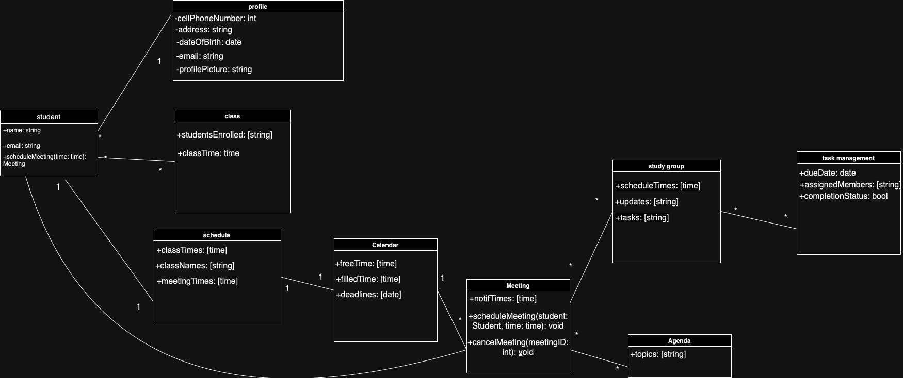

# D3. Analysis

_Group 02 - "Timely"_\
_Group Members: Brody England, Christian Butler, Dylan Hyer, Ian Nieto, Nyle Huntley, Sofia Mendoza_

## 1. System Description
The tedious and time-consuming problem of managing and coordinating schedules for academic, work, and personal commitments affects busy university students, the impact of which is reduced productivity, missed deadlines, and increased stress as students struggle to find common meeting times within groups. For university students who have to work and schedule meetings regularly with groups of other students, Timely is a scheduling and collaboration web app that simplifies compiling your peers' schedules and organizing group meetings; unlike Coursicle.com, our product automates the processes of importing student schedules and finding common meeting times that work for everyone. Timely is a scheduling and collaboration web app that helps university students save time and energy by making it easier to find common meeting times, automating the organization of group meetings and collaboration sessions.

The **Timely** platform revolves around three main functionalities: **profiles**, **calendars**, and **study groups**. When a **university student** signs up for **Timely**, they create a **_profile_** that stores their *personal details*, including *username*, *email*, *availability*, and *class schedule*. These **profiles** are essential as they form the basis for each user’s experience, and allow for schedules to be **_imported_** and updated automatically. **University student**s can update their *class schedules* at any time, and these updates are reflected in their **calendar**. The **calendar** is the core of **Timely**. It allows students to see their academic, personal, and group-related events all in one place. The **calendar** syncs with each **university student**'s *class schedule* and any *personal events* they choose to add. It automatically updates with scheduled **_meetings_** for group projects. By providing an integrated view of the student’s commitments, the **calendar** helps ensure that no conflicts arise between academic and personal events, while also facilitating **_group collaboration_**. **Meetings** are an essential part of **Timely**’s functionality. **University student**s can schedule **meetings** with their peers based on their shared *availability*. Once a **meeting** is scheduled, students receive notifications to remind them of the time and location. These notifications can be customized to appear as emails, app notifications, or SMS alerts, ensuring that students never miss an important group session. Each **meeting** can include an **agenda** that sets out the topics to be discussed, helping the group stay focused and productive during their time together. A key feature of **Timely** is the ability to form **study groups**. A **study group** allows multiple **university student**s to collaborate on group projects, **_share schedules_**, and set up **_meetings_**. Within a **study group**, members can set group goals and keep track of **_meeting times_**. **Study groups** provide students with a collaborative space where they can manage their time more efficiently and ensure that everyone is on the same page. Additionally, **study groups** enable members to share important updates and collaborate outside of scheduled **meetings**. **Timely** also includes a **task management** system, where **university student**s can create, assign, and track tasks within their **study group**. Each task includes *due dates*, *assigned members*, and *status* updates. The **task management** system ensures that all group members know their responsibilities and can track the progress of each part of the project. **Timely** provides users with notifications for upcoming **_meetings_**, changes to **_study groups_**, or new tasks. These notifications can be customized based on user preference, allowing each **university student** to choose how and when they want to be alerted about group activities or important deadlines. The notification system ensures that students remain informed and never miss an important update or event. In terms of system accessibility, **Timely** works across commonly used desktop and mobile browsers, providing a seamless experience for **university student**s on multiple devices. The user interface is simple and intuitive, designed to be accessible even for users who are not tech-savvy. In summary, **Timely** offers **university student**s a powerful tool to manage their schedules, collaborate effectively, and reduce the stress associated with group projects. By integrating **profiles**, **calendars**, **study groups**, **task management**, and **meeting** functionalities, **Timely** creates a streamlined experience that helps students stay organized, meet deadlines, and succeed in their academic endeavors.

## 2. Model

- must have at least 8 classes, can add more requirements to system description if needed
