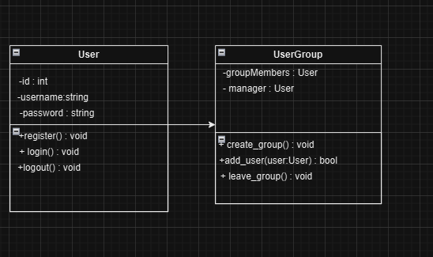
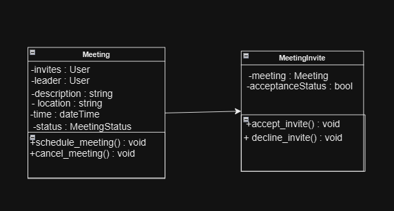

# D5. Design

_Group 02 - "Timely"_\
_Group Members: Brody England, Christian Butler, Dylan Hyer, Ian Nieto, Nyle Huntley, Sofia Mendoza_

## 1. Description
The tedious and time-consuming problem of managing and coordinating schedules for academic, work, and personal commitments affects busy university students, the impact of which is reduced productivity, missed deadlines, and increased stress as students struggle to find common meeting times within groups. For university students who have to work and schedule meetings regularly with groups of other students, Timely is a scheduling and collaboration web app that simplifies compiling your peers' schedules and organizing group meetings; unlike Coursicle.com, our product automates the processes of importing student schedules and finding common meeting times that work for everyone. Timely is a scheduling and collaboration web app that helps university students save time and energy by making it easier to find common meeting times, automating the organization of group meetings and collaboration sessions.

## 2. Architecture

## 3. Class Diagram

## 4. Sequence Diagram

## 5. Design Patterns

 
This diagram represents the SRP design pattern, as there are 2 classes relating to the same topic, but multiple classes have their own specific task to manage to achieve the final goal. 
 

 
This diagram is another example of an SRP as these 2 classes are being used to schedule meetings, The meetings class actually creates the meeting, and the Meeting Invite class actually sends out invites to the users. 

## 6. Design Principles
- Reviewing the SOLID Principles, the first principle is SRP, or Single Responsibility Principle which states that a class should only have one single responsibility.

In our program, all of our classes are designed to only have one purpose. An example of the single responsibility principle in our program is the Profile class. The profile class contains all of a user's vital information. The Profile class is only allowed to be interacted with by the User class, which is when a user can input and register their profile information. Thus, the profile class has one job: store information about the user.

- The second SOLID Principle is OCP, which stands for Open/closed Principle. This means that entities should be open for extension, but closed for modification.

The Calendar class in our program would be an example of a class that follows the open/closed principle. The calendar class in our program stores class information that is given by the user, study group information, and meeting times. All of these can be extended by adding something like a new class, new study group, or new meeting time; all of these can extend the class but not modify the class.

- The third SOLID Principle is LSP, or the Liskov substitution principle which states that you should be able to replace a parent class with a subclass and have no issue in the program.

Although we do not currently have any subclasses implemented in our program, we do plan to implement the Liskov Substitution Principle in our program when we create these subclasses. Our team could implement a new subclass under Profile called viewProfile. This new subclass would be the same as the Profile class, but would allow the user to change what they want to be public about their profile (ex: private class sections and names).

- The next SOLID principle is ISP, or Interface Segregation Principle which states that many client-specific interfaces are better than one general interface.

Our program has many pages/ interfaces for a user to interact with. To register a profile, a user is directed to an HTML page where all of their needed information is gathered. Once a user is signed in, they are taken to their calendar, which shows them their class times, group invites, and events. A user can add a class to their calendar by registering a new class on a separate HTML page. The user can also add events using a separate HTML page. There are many interfaces for a user to interact with on our website, with many more to be added.

- The last SOLID principle is DIP, or the Dependency Inversion Principle, which states that one 
should depend upon Abstractions and not depend upon concretions.

An example of this principle in our program can be seen in our framework, SQLite. Our website uses SQLite to take in data from the user and processes the data using a high-level layer which is used for optimizing and executing these queries. This layer delegates the storage-related tasks to the lower-level layers through abstraction. 

