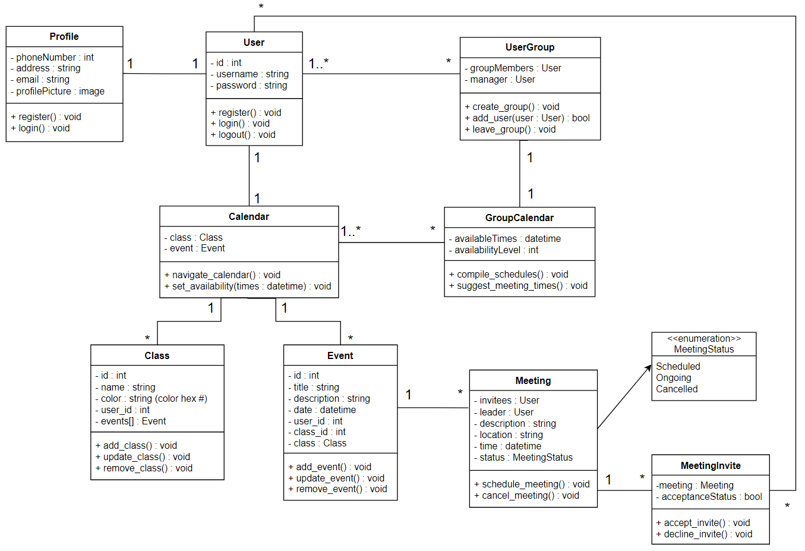

# D5. Design

_Group 02 - "Timely"_\
_Group Members: Brody England, Christian Butler, Dylan Hyer, Ian Nieto, Nyle Huntley, Sofia Mendoza_

## 1. Description
The tedious and time-consuming problem of managing and coordinating schedules for academic, work, and personal commitments affects busy university students, the impact of which is reduced productivity, missed deadlines, and increased stress as students struggle to find common meeting times within groups. For university students who have to work and schedule meetings regularly with groups of other students, Timely is a scheduling and collaboration web app that simplifies compiling your peers' schedules and organizing group meetings; unlike Coursicle.com, our product automates the processes of importing student schedules and finding common meeting times that work for everyone. Timely is a scheduling and collaboration web app that helps university students save time and energy by making it easier to find common meeting times, automating the organization of group meetings and collaboration sessions.

## 2. Architecture

## 3. Class Diagram

## 4. Sequence Diagram

## 5. Design Patterns

 
This diagram represents the SRP design patter, as there are 2 classes relating to the same topic, but multiple classes have thier own specific task to manage to achieve the final goal. 

## 6. Design Principles
