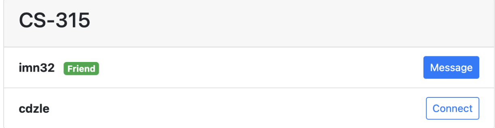

# D6. Implementation 2

_Group 02 - "Timely"_\
_Group Members: Brody England, Christian Butler, Dylan Hyer, Ian Nieto, Nyle Huntley, Sofia Mendoza_

## 1. Introduction
Timely is a web application designed to simplify scheduling and collaboration for university students juggling busy academic and social lives. From study group organizers to overwhelmed undergraduates trying to keep track of deadlines, Timely helps users stay on top of their commitments. Without a tool like Timely, students can struggle to find mutually available times for group meetings or effectively coordinate schedules. Timely's primary goal is to make scheduling effortless and collaborative, so students can focus on what matters most—learning and succeeding together.

Timely offers three key features: study group management, calendar synchronization, and communication tools. The study group management feature allows users to create and join study groups, set up meetings, and aggregate schedules to find the best times to meet. Calendar synchronization integrates directly with platforms like Canvas, letting students import their class schedules and assignments seamlessly. Finally, the communication tools include messaging and file sharing, which enable students to exchange important resources and stay connected with their peers. Together, these features foster a collaborative environment, helping students save time, reduce stress, and maximize productivity.

With Timely, university students can turn scheduling chaos into organized success.

https://github.com/bme2003/timely

## 2. Implemented requirements

Below is the documentation of implemented requirements for the current release of the `app.py` application, organized by the name of the team member who implemented them. Each entry includes the description of the requirement, associated GitHub issue, pull request, the implementer, approver, and screenshots where applicable.

## 1. Christian Butler

### Requirement: Add and manage calendar events to organize my schedule effectively.
- **Issue**: Event Management and Scheduling (Priority: 9, Hours: 8)
- **Pull Request**: Integrated calendar event creation and management
- **Implemented by**: Christian Butler
- **Approved by**: Ian Nieto
- **Screenshot**: 

### Requirement: Securely log in and manage my profile.
- **Issue**: Secure User Authentication and Profile Management (Priority: 8, Hours: 7)
- **Pull Request**: Added hashed password authentication and profile editing
- **Implemented by**: Christian Butler
- **Approved by**: Ian Nieto
- **Screenshot**: 

---

## 2. Ian Nieto

### Requirement: Notifications for upcoming events to help stay organized.
- **Issue**: Notification System for Events (Priority: 7, Hours: 6)
- **Pull Request**: Implemented event reminder notifications
- **Implemented by**: Ian Nieto
- **Approved by**: Christian Butler
- **Screenshot**: 

### Requirement: Import external calendar files (e.g., iCalendar) to sync with my schedule.
- **Issue**: iCalendar File Import (Priority: 6, Hours: 5)
- **Pull Request**: Added functionality for importing iCalendar files
- **Implemented by**: Ian Nieto
- **Approved by**: Christian Butler
- **Screenshot**: 
- **Screenshot**: 

---

## 3. Dylan Hyer

### Requirement: Send and accept/decline friend requests to connect with classmates.
- **Issue**: Ability to quickly create, accept, or decline study invitations (Priority: 10, Hours: 6)
- **Pull Request**: Middle-end #94
- **Implemented by**: Dylan Hyer
- **Approved by**: Ian Nieto
- **Screenshot**: 

---

## 4. Nyle Huntley

### Requirement: Ensure secure data submissions with CSRF protection.
- **Issue**: Implementing CSRF Protection for Forms (Priority: 6, Hours: 4)
- **Pull Request**: Integrated CSRF protection for all form submissions
- **Implemented by**: Nyle Huntley
- **Approved by**: Ian Nieto
- **Screenshot**: 

### Requirement: Provide error messages and feedback for invalid form submissions.
- **Issue**: Validation and Error Messaging (Priority: 7, Hours: 5)
- **Pull Request**: Added validation and user feedback for form errors
- **Implemented by**: Nyle Huntley
- **Approved by**: Christian Butler
- **Screenshot**: 

## 5. Brody England

### Requirement: Build and optimize the mobile version of the app for improved usability.
- **Issue**: Mobile Development and Optimization (Priority: 8, Hours: 7)
- **Pull Request**: Added responsive design and improved navigation for mobile devices
- **Implemented by**: Brody England
- **Approved by**: Ian Nieto
- **Screenshot**: 

### Requirement: Ensure efficient data fetching and rendering for mobile users.
- **Issue**: Mobile Data Optimization (Priority: 7, Hours: 6)
- **Pull Request**: Implemented optimized API calls and lazy loading for mobile views
- **Implemented by**: Brody England
- **Approved by**: Christian Butler
- **Screenshot**: 

---

## Notes
- All pull requests were reviewed and approved before merging.
- Screenshots are placeholders and should be replaced with actual images from the application.
- Follow-ups for any incomplete requirements or adjustments to the implementation will be handled in the next sprint cycle.

## 3. Tests

### 3.1 Unit tests
1. **Test framework:** Unittest and SQLAlchemy's built-in database testing

2. **Automated test file:** https://github.com/bme2003/timely/blob/main/tests/test_app.py

3. **Example test case:** The test_mocked_fetch_canvas_events test case creates a mock object consisting of data that might be pulled from a Canvas calendar event and ensures proper error handling by sending a request to the Canvas event importing endpoint, checking for a Canvas client error, and ensuring the error message displays properly.

4. **Result of automated test execution:**
Testing executed locally through cloned repository again; only newly added unit tests for Implementation 2 were ran here.

### 3.2 Acceptance tests

1. **Test Framework**
The acceptance tests were implemented using **Selenium** for browser-based user interaction testing.

2. **Automated Test File**
The acceptance tests are included in the following file:
[https://github.com/bme2003/timely/blob/main/tests/acceptance_tests.py](https://github.com/bme2003/timely/blob/main/tests/acceptance_tests.py)

3. **Example Test Case**
The `test_signup` acceptance test validates the user signup functionality by performing the following steps:
- Navigates to the **Signup** page.
- Inputs the username (`"testuser"`), email (`"testuser@example.com"`), password (`"Password123"`), and a sample Canvas iCal URL (`"https://example.com/calendar.ics"`).
- Submits the form.
- Verifies that the success message `"Account created successfully!"` is displayed.

4. **Result of Automated Test Execution**
Testing was executed locally using the cloned repository. All four acceptance tests passed successfully, validating the implemented features:
1. **Landing Page Navigation**  
   Ensures the homepage loads correctly with visible links to "Login" and "Sign Up."
2. **User Signup**  
   Verifies new users can create an account successfully.
3. **User Login**  
   Confirms that users can log in using valid credentials and access the Calendar page.
4. **User Logout**  
   Validates that users can log out and see the appropriate success message.

## 4. Demo

## 5. Code quality
Our team maintained high code quality for app.py by adopting several best practices and conventions. These ensured the code was robust, readable, and maintainable, while also facilitating team collaboration and minimizing errors. Here are the key aspects of what went well in the code:

1. **Clear and Self-Documenting Code**

Implementation: Variables, functions, and classes were named clearly to reflect their purpose. For example, fetch_canvas_events and validate_user_input describe their functionality at a glance.

Benefit: This made it easy for team members to understand the code without needing extensive comments or external documentation.

2. **Consistent Formatting**

Implementation: We adhered to consistent formatting throughout the file, including:

Proper indentation and spacing.

Aligned brackets and clear separation of logical blocks.

Benefit: Consistent formatting improved code readability and ensured that all team members could easily navigate the file.

3. **Robust Error Handling**

Implementation: The application uses clear try-except blocks to handle errors gracefully, such as managing database connection issues or invalid user input.

Benefit: This ensured the application could recover from errors without crashing, providing a better user experience and simplifying debugging.

4. **Separation of Concerns**

Implementation: We followed modular design principles by separating logic into distinct functions and classes. For instance, database operations were managed through SQLAlchemy models, while route handling was confined to Flask route decorators.

Benefit: This made the codebase easier to test, debug, and extend, as changes in one part of the application did not inadvertently affect others.

5. **Use of Environment Variables**

Implementation: Sensitive information like secret keys and database URIs were stored in environment variables and loaded using dotenv.

Benefit: This enhanced security by keeping sensitive data out of the codebase, reducing the risk of exposure.

6. **Testing and Validation**

Implementation: Data input was validated at both the client and server levels. Additionally, unit tests were written to test critical components of the application.

Benefit: Validation and testing ensured that the code worked as intended and prevented unexpected behaviors during runtime. 

7. **Scalability and Maintainability**

Implementation: The use of Flask blueprints and modular components made it easier to scale the application and add new features.

Benefit: This approach supported future growth and simplified collaboration by maintaining a well-organized codebase.

## 6. Lessons learned
In retrospect, our team learned valuable lessons during this second release that will significantly shape how we approach future development projects. One of the key takeaways was the importance of improving communication and fostering overlapping knowledge within the team. Miscommunication sometimes led to delays and rework, while the lack of shared expertise in certain areas, such as backend development or front-end design, created bottlenecks. Moving forward, we would focus on establishing clearer communication channels, such as regular check-ins and detailed documentation, to ensure everyone stays aligned.

We also realized the importance of starting tasks earlier to reduce last-minute stress and allow more time for addressing unforeseen challenges. While we made progress in prioritizing core functionalities, like backend fixes, over enhancements, integrating testing throughout development was still a struggle at times. If we were to continue developing the project, we would adopt a more iterative approach, incorporating feedback and testing at smaller intervals to ensure higher reliability and better overall quality.

Additionally, we found that clearer role assignments and cross-training opportunities would help address gaps in knowledge and improve accountability. By building a culture of shared learning and supporting each other in unfamiliar tasks, we could become a more cohesive and adaptable team. Overall, these lessons will help us improve our processes and deliver better results in future projects.
